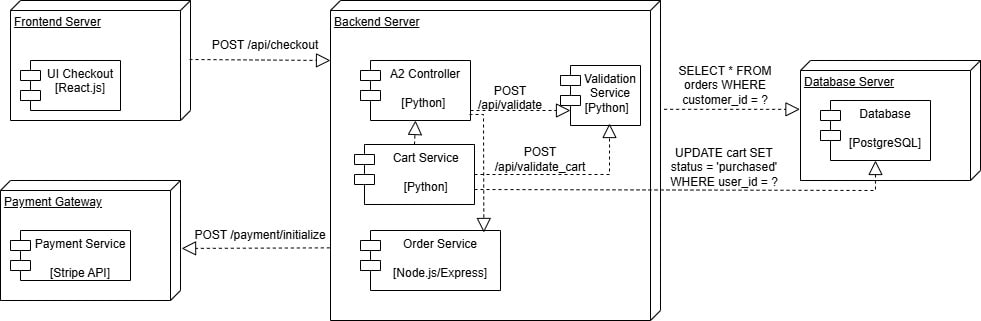

# Анализ бизнес-процессов и проектирование информационной системы интернет-магазина



## О проекте

Проект посвящён анализу бизнес-процесса оформления заказа в интернет-магазине и моделированию информационной системы, поддерживающей данный процесс.

В рамках проекта выполнен анализ предметной области, определены участники процесса, информационные потоки и разработаны модели системы с использованием методологий IDEF0 и UML.

## Цель проекта

Провести анализ процесса оформления заказа интернет-магазина, определить взаимодействие участников процесса и разработать модели представления информационной системы.

## Выполненные задачи

- анализ предметной области;
- определение границ бизнес-процесса;
- выявление участников процесса;
- описание входных и выходных данных;
- построение функциональной модели IDEF0;
- разработка UML-диаграмм системы;
- описание компонентной архитектуры.

## Использованные методологии и инструменты

- IDEF0 — функциональное моделирование бизнес-процессов;
- UML — моделирование информационных систем;
- Use Case Diagram;
- Sequence Diagram;
- Component Diagram;
- Deployment Diagram;
- Draw.io.

## Артефакты проекта

### Бизнес-анализ

- описание предметной области;
- границы процесса;
- участники процесса;
- входы и выходы.

### Функциональное моделирование

Разработаны IDEF0-модели:

- контекстная диаграмма A-0;
- диаграмма процесса A0;
- декомпозиция процессов A1-A3.

### Проектирование системы

Разработаны UML-модели:

- Use Case Diagram;
- Sequence Diagram;
- Component Diagram;
- Deployment Diagram.

## Структура репозитория

```
├── diagrams/ # Диаграммы IDEF0 и UML
├── docs/ # Описание проекта и аналитические документы
├── report/ # Полный отчёт проекта

```

## Результат

В результате была разработана модель бизнес-процесса оформления заказа и спроектирована структура информационной системы, которая может использоваться как основа для дальнейшего уточнения требований и автоматизации процесса.
